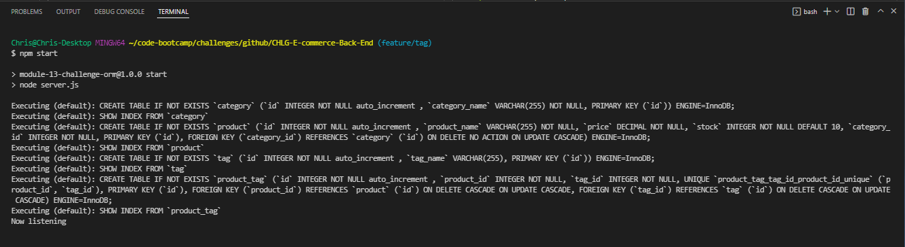
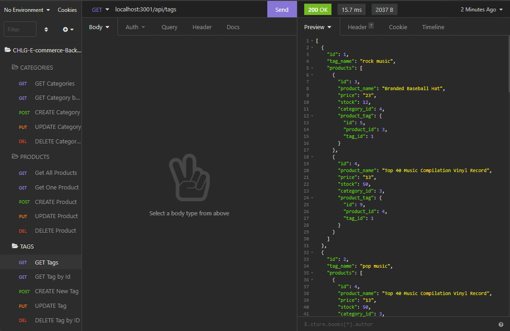

# CHLG-E-commerce-Back-End


_You can access more badges and their purposes at [shields.io](https://shields.io)_

## Description:

This application is the back-end configuration for an e-commerce website using Sequelize to communicate with the MySQL server and provide data for the API routes in express.  You can query your database with the following use case routes:

- GET all Products, Tags, or Categories
- GET a single Product, Tag, or Cateory by Id
- CREATE/POST a new Product, Tag, or Cateory
- UPDATE/PUT a Product, Tag, or Cateory by Id
- DESTROY/DELETE a a Product, Tag, or Cateory by Id

----------------------------------

## Table of Contents:
- [Description](#description)
- [Installation](#installation)
- [Usage](#usage)
- [License](#license)
- [Questions](#questions)

----------------------------------

## Installation:

_Follow these steps to properly install this application:_

Download the repo from Github.  Run ```npm install``` for the following dependencies in your CLI, dotenv, express, mysql2, and sequelize.

## Usage:

- Open terminal
- Run ```source db/schema.sql``` to create the database
- Run ```npm start``` to initialize server
- Turn off server and run ```node seeds``` to seed database tables with data
- Start server again with ```npm start``` and use Insomnia to test/use associated routes

[Walkthrough video](https://watch.screencastify.com/v/U6wEVYKIIfudGfv1QpRT)





## License:

NOTICE: This application is covered by [MIT License](https://choosealicense.com/licenses/mit/).

## Questions:

- Github: [cangalet](https://github.com/cangalet)
- Email:  cangalet@gmail.com